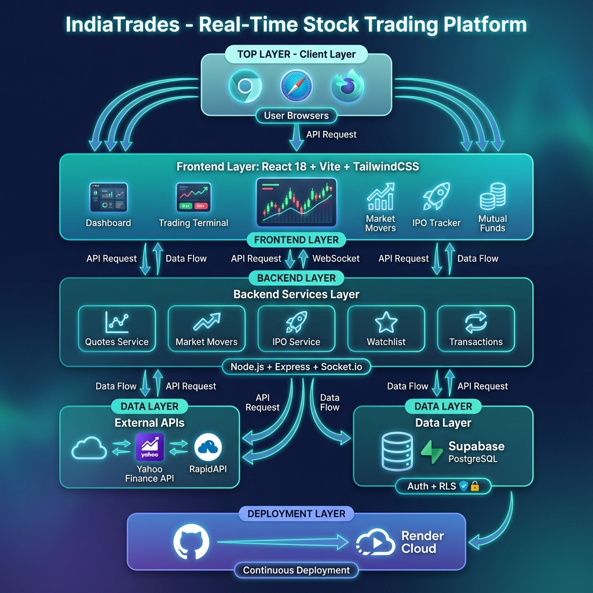

<div align="center">

# 📈 IndiaTrades - Real-Time Indian Stock Market Platform

[](https://reactjs.org/)
[](https://nodejs.org/)
[](https://socket.io/)
[](https://supabase.com/)
[](https://tailwindcss.com/)
[](LICENSE)

**A production-ready, enterprise-grade stock market trading and analytics platform for Indian equities (NSE/BSE)**

[Live Demo](https://india-trades-live.onrender.com) • [API Docs](./docs/API_DOCUMENTATION.md) • [Architecture](./docs/ARCHITECTURE.md) • [Developer Guide](./docs/DEVELOPER_GUIDE.md)

</div>

---

## 🎯 Executive Summary

**IndiaTrades** is a full-stack fintech application that provides real-time stock market data, trading capabilities, portfolio management, and market analytics for Indian equities. Built with modern technologies and designed with enterprise-grade architecture patterns, it demonstrates proficiency in:

- **Real-Time Systems** - WebSocket-based live price streaming
- **Event-Driven Architecture** - Pub/Sub pattern for efficient data distribution
- **Microservices-Ready Design** - Modular, scalable backend structure
- **Secure Authentication** - JWT-based auth with Row Level Security (RLS)
- **Modern Frontend** - React 18 with advanced state management

---

## 🏗️ System Architecture

<div align="center">



</div>

---

## ✨ Key Features

### 📊 Real-Time Dashboard

- Live price streaming with WebSocket connections
- Interactive candlestick charts (Lightweight Charts)
- Customizable watchlist with instant updates
- Portfolio value tracking with P&L calculations

### 📈 Market Analytics

- **Top Gainers/Losers** - Real-time market movers
- **Volume Shockers** - Unusual volume detection
- **Price Shockers** - Significant price movements
- **52-Week High/Low** tracking

### 💹 Trading System

- Buy/Sell order placement (NSE/BSE)
- Delivery and Intraday options
- Real-time order status updates
- Transaction history with P&L summary

### 🎯 IPO Tracker

- Upcoming IPO calendar
- Subscription status tracking
- GMP (Grey Market Premium) updates
- Listing gain analysis

### 💰 Mutual Funds

- Fund categorization (Equity, Debt, Hybrid)
- NAV tracking and returns analysis
- Star rating display
- AUM and asset size metrics

### 🔐 Authentication & Security

- Supabase Auth integration
- JWT-based session management
- Row Level Security (RLS) policies
- Secure API endpoints

---

## 🛠️ Technology Stack

| Layer | Technologies |
|-------|-------------|
| **Frontend** | React 18, Vite 5, TailwindCSS 3.3, Framer Motion |
| **State Management** | React Context API, Custom Hooks |
| **Charts** | Lightweight Charts (TradingView) |
| **Backend** | Node.js 18+, Express 4.18, Socket.io 4.7 |
| **Database** | Supabase (PostgreSQL), Row Level Security |
| **Authentication** | Supabase Auth (JWT) |
| **APIs** | Yahoo Finance, RapidAPI (Indian Stock Exchange) |
| **Deployment** | Render (Backend + Frontend), Vercel (Alternative) |

---

## 🚀 Quick Start

### Prerequisites

- Node.js 18+ and npm
- Git
- Supabase account (for database)

### 1. Clone the Repository

```bash
git clone https://github.com/Mmaneesh007/india-trade.git
cd india-trade
```

### 2. Backend Setup

```bash
cd backend
npm install

# Create .env file
cp .env.example .env
# Add your Supabase credentials to .env

npm run dev
```

*Backend runs on `http://localhost:4000`*

### 3. Frontend Setup

```bash
cd frontend
npm install
npm run dev
```

*Frontend runs on `http://localhost:5173`*

### 4. Environment Variables

**Backend (.env)**

```env
SUPABASE_URL=your_supabase_project_url
SUPABASE_ANON_KEY=your_supabase_anon_key
PORT=4000
```

**Frontend (.env)**

```env
VITE_API_URL=http://localhost:4000
VITE_SUPABASE_URL=your_supabase_project_url
VITE_SUPABASE_ANON_KEY=your_supabase_anon_key
```

---

## 📁 Project Structure

```
indian-stock-live/
├── backend/                    # Node.js API Server
│   ├── routes/                 # API Route Handlers
│   │   ├── quotes.js           # Stock quotes endpoints
│   │   ├── movers.js           # Market movers (gainers/losers)
│   │   ├── transactions.js     # Trading transactions
│   │   ├── watchlist.js        # Watchlist management
│   │   ├── ipo.js              # IPO data endpoints
│   │   └── mutualfunds.js      # Mutual funds data
│   ├── services/               # Business Logic
│   │   └── marketData.js       # Yahoo Finance integration
│   ├── socket.js               # WebSocket server setup
│   ├── supabaseClient.js       # Database client
│   └── server.js               # Express app entry point
│
├── frontend/                   # React Application
│   ├── src/
│   │   ├── pages/              # Route Components
│   │   │   ├── Dashboard.jsx   # Main trading dashboard
│   │   │   ├── MarketMovers.jsx# Market analytics page
│   │   │   ├── TradePage.jsx   # Stock trading page
│   │   │   └── MutualFunds.jsx # Mutual funds explorer
│   │   ├── components/         # Reusable UI Components
│   │   │   ├── Header.jsx      # Navigation & search
│   │   │   ├── StockChart.jsx  # Candlestick charts
│   │   │   ├── TopMovers.jsx   # Gainers/Losers widget
│   │   │   └── Watchlist.jsx   # Watchlist component
│   │   ├── context/            # React Context Providers
│   │   └── api.js              # API client configuration
│   └── vite.config.js          # Build configuration
│
├── docs/                       # Documentation
│   ├── ARCHITECTURE.md         # System design document
│   ├── API_DOCUMENTATION.md    # API reference
│   ├── DATABASE_SCHEMA.md      # Database design
│   ├── DEVELOPER_GUIDE.md      # Developer onboarding
│   ├── DEVOPS_GUIDE.md         # Operations guide
│   └── INTERVIEW_PREP.md       # MNC interview talking points
│
└── render.yaml                 # Render deployment config
```

---

## 📚 Documentation

| Document | Description |
|----------|-------------|
| [Architecture](./docs/ARCHITECTURE.md) | System design, data flow, scalability |
| [API Documentation](./docs/API_DOCUMENTATION.md) | Complete API reference |
| [Database Schema](./docs/DATABASE_SCHEMA.md) | Supabase tables, RLS policies |
| [Developer Guide](./docs/DEVELOPER_GUIDE.md) | Setup, conventions, testing |
| [DevOps Guide](./docs/DEVOPS_GUIDE.md) | Deployment, monitoring, operations |
| [Interview Prep](./docs/INTERVIEW_PREP.md) | System design discussion points |

---

## 🎤 For Interviewers

This project demonstrates:

1. **System Design Skills** - Scalable real-time architecture
2. **Full-Stack Proficiency** - React + Node.js + PostgreSQL
3. **API Design** - RESTful + WebSocket hybrid approach
4. **Security Best Practices** - RLS, JWT, secure configurations
5. **DevOps Knowledge** - CI/CD, containerization-ready
6. **Code Quality** - Modular, maintainable structure

📖 See [INTERVIEW_PREP.md](./docs/INTERVIEW_PREP.md) for detailed system design discussion points.

---

## 🤝 Contributing

1. Fork the repository
2. Create a feature branch (`git checkout -b feature/AmazingFeature`)
3. Commit changes (`git commit -m 'Add AmazingFeature'`)
4. Push to branch (`git push origin feature/AmazingFeature`)
5. Open a Pull Request

---

## 📄 License

This project is licensed under the MIT License - see the [LICENSE](LICENSE) file for details.

---

## 👨‍💻 Author

**Manish**  
Full-Stack Developer | Fintech Enthusiast

[](https://github.com/Mmaneesh007)
[](https://linkedin.com/in/)

---

<div align="center">

**⭐ Star this repository if you find it helpful!**

*Built with ❤️ for the Indian Stock Market*

</div>
