# System Architecture

> **IndiaTrades** - Enterprise-Grade Real-Time Stock Trading Platform

---

## Table of Contents

1. [Architecture Overview](#architecture-overview)
2. [System Components](#system-components)
3. [Data Flow Architecture](#data-flow-architecture)
4. [Real-Time Communication](#real-time-communication)
5. [Security Architecture](#security-architecture)
6. [Scalability Considerations](#scalability-considerations)
7. [Technology Decisions](#technology-decisions)

---

## Architecture Overview

IndiaTrades follows a **modern three-tier architecture** with real-time capabilities, designed for scalability and maintainability.

### High-Level Architecture


---

## System Components

### Frontend Architecture

```mermaid
flowchart LR
    subgraph Pages["📄 Pages"]
        Dashboard["Dashboard"]
        MarketMovers["Market Movers"]
        TradePage["Trade Page"]
        MutualFunds["Mutual Funds"]
        IPODetail["IPO Detail"]
    end

    subgraph Components["🧩 Components"]
        Header["Header"]
        StockChart["Stock Chart"]
        TopMovers["Top Movers"]
        Watchlist["Watchlist"]
        TransactionHistory["Transaction History"]
    end

    subgraph Context["🔄 Context"]
        SocketContext["Socket Context"]
        AuthContext["Auth Context"]
    end

    subgraph Services["📡 Services"]
        API["API Client (Axios)"]
        SocketClient["Socket.io Client"]
        SupabaseClient["Supabase Client"]
    end

    Pages --> Components
    Pages --> Context
    Components --> Services
```



#### Key Frontend Patterns

| Pattern | Implementation | Purpose |
|---------|---------------|---------|
| **Context API** | `SocketContext` | Global WebSocket state management |
| **Custom Hooks** | `useSocket`, `useAuth` | Reusable stateful logic |
| **Lazy Loading** | React.lazy() | Code splitting for performance |
| **Component Composition** | Header, Dashboard | Modular UI architecture |

### Backend Architecture


#### API Route Mapping

| Route | Method | Description |
|-------|--------|-------------|
| `/api/quotes/:symbol` | GET | Real-time stock quote |
| `/api/quotes/:symbol/candles` | GET | Historical OHLC data |
| `/api/search` | GET | Stock symbol search |
| `/api/movers/gainers` | GET | Top gaining stocks |
| `/api/movers/losers` | GET | Top losing stocks |
| `/api/movers/volume-shockers` | GET | High volume stocks |
| `/api/ipo/list` | GET | IPO listings |
| `/api/watchlist/:userId` | GET/POST/DELETE | Watchlist CRUD |
| `/api/transactions/:userId` | GET | Transaction history |

---

## Data Flow Architecture

### Request-Response Flow (REST)


### Real-Time Data Flow (WebSocket)


---

## Real-Time Communication

### WebSocket Architecture

IndiaTrades uses **Socket.io** for bi-directional real-time communication with the following features:

#### Room-Based Subscriptions

```javascript
// Server-side room management
socket.on('subscribe', (symbol) => {
    socket.join(symbol.toUpperCase());
    activeSymbols.add(symbol);
});

socket.on('unsubscribe', (symbol) => {
    socket.leave(symbol.toUpperCase());
});
```

#### Smart Polling Strategy


**Benefits:**

- ✅ Only polls for symbols with active subscribers
- ✅ Reduces unnecessary API calls
- ✅ Horizontal scaling ready (Redis adapter compatible)
- ✅ Automatic reconnection handling

---

## Security Architecture

### Authentication Flow


### Row Level Security (RLS)

```mermaid
flowchart TB
    subgraph Request["📥 Incoming Request"]
        UserID["User ID from JWT"]
    end

    subgraph RLS["🛡️ Row Level Security"]
        Policy1["SELECT: auth.uid() = user_id"]
        Policy2["INSERT: auth.uid() = user_id"]
        Policy3["DELETE: auth.uid() = user_id"]
    end

    subgraph Data["📊 Data Access"]
        Watchlist["Watchlist Table"]
        Transactions["Transactions Table"]
    end

    UserID --> RLS
    RLS --> Data
```



### Security Layers

| Layer | Implementation | Purpose |
|-------|---------------|---------|
| **Transport** | HTTPS/WSS | Encrypted communication |
| **Authentication** | Supabase Auth (JWT) | Identity verification |
| **Authorization** | Row Level Security | Data access control |
| **API Security** | CORS, Rate Limiting | Request validation |
| **Secrets** | Environment Variables | Credential protection |

---

## Scalability Considerations

### Current Architecture Limits

| Component | Current Limit | Scaling Strategy |
|-----------|--------------|------------------|
| WebSocket Connections | ~10,000 | Horizontal scaling with Redis adapter |
| API Requests | ~1,000 RPS | Load balancer + multiple instances |
| Database Connections | ~100 | Connection pooling (PgBouncer) |
| External API Calls | Rate limited | Caching layer (Redis) |

### Horizontal Scaling Strategy


### Caching Strategy


**Cache Locations:**

- **Market Movers**: 5-minute cache for trending data
- **IPO Data**: 1-hour cache for static listings
- **Mutual Funds**: 15-minute cache for NAV data

---

## Technology Decisions

### Frontend Choices

| Decision | Choice | Rationale |
|----------|--------|-----------|
| Framework | React 18 | Industry standard, large ecosystem |
| Build Tool | Vite 5 | Fast HMR, optimized builds |
| Styling | TailwindCSS | Utility-first, rapid development |
| Charts | Lightweight Charts | TradingView quality, small bundle |
| Animations | Framer Motion | Declarative, performant |

### Backend Choices

| Decision | Choice | Rationale |
|----------|--------|-----------|
| Runtime | Node.js 18 | Non-blocking I/O for real-time |
| Framework | Express 4.18 | Mature, extensive middleware |
| WebSocket | Socket.io 4.7 | Fallback support, room abstraction |
| Database | Supabase | Managed PostgreSQL + Auth + RLS |

### Why Not Alternatives?

| Alternative | Considered | Decision |
|-------------|------------|----------|
| Next.js | Yes | Overkill for SPA; Vite faster for pure CSR |
| GraphQL | Yes | REST sufficient; simpler for team |
| Redis | Future | In-memory cache adequate for MVP |
| Kubernetes | Future | Render simpler for current scale |

---

## Future Architecture Roadmap

### Phase 1: Performance (Current)

- ✅ WebSocket real-time updates
- ✅ In-memory caching
- ✅ Optimized builds

### Phase 2: Scaling (Next)

- [ ] Redis for distributed cache
- [ ] Socket.io Redis adapter
- [ ] Rate limiting middleware

### Phase 3: Enterprise

- [ ] Kubernetes deployment
- [ ] Service mesh (Istio)
- [ ] Observability stack (Prometheus/Grafana)
- [ ] Event sourcing for transactions

---

<div align="center">

**[← Back to README](../README.md)** | **[API Documentation →](./API_DOCUMENTATION.md)**

</div>
