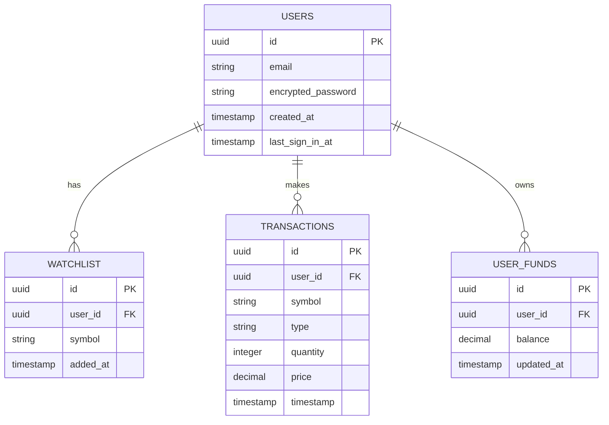
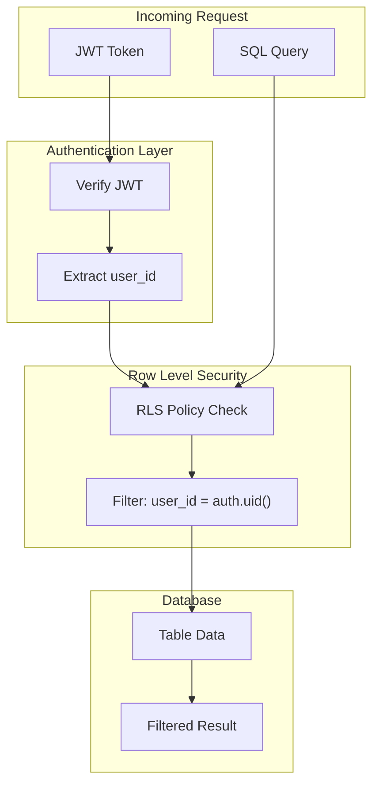
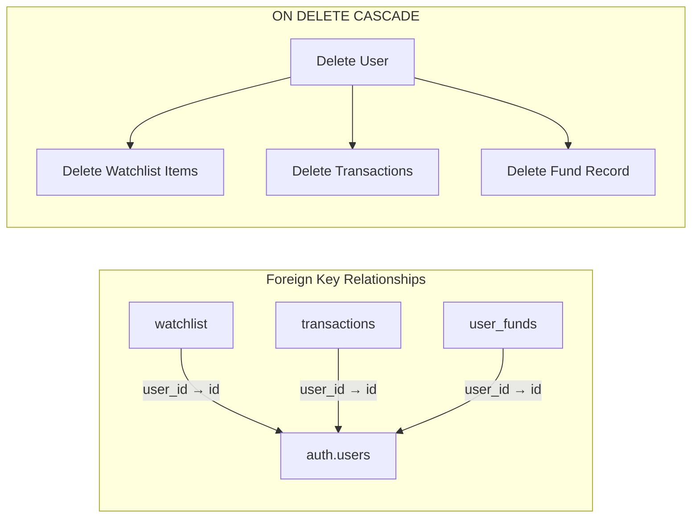

# Database Schema

> Supabase PostgreSQL Database Design for IndiaTrades

---

## Table of Contents

1. [Overview](#overview)
2. [Entity Relationship Diagram](#entity-relationship-diagram)
3. [Table Schemas](#table-schemas)
4. [Row Level Security (RLS)](#row-level-security-rls)
5. [Indexes](#indexes)
6. [Data Integrity](#data-integrity)
7. [Migration Scripts](#migration-scripts)

---

## Overview

IndiaTrades uses **Supabase** as its backend-as-a-service, which provides:

- **PostgreSQL Database** - Managed, scalable relational database
- **Authentication** - Built-in user management with JWT
- **Row Level Security** - Fine-grained access control
- **Real-time Subscriptions** - Live data sync (future enhancement)

### Database Statistics

| Metric | Value |
|--------|-------|
| Tables | 3 |
| Total Columns | 15 |
| RLS Policies | 6 |
| Indexes | 4 |

---

## Entity Relationship Diagram



---

## Table Schemas

### 1. Users Table (Managed by Supabase Auth)

The `auth.users` table is managed automatically by Supabase Auth.

```sql
-- Supabase Auth manages this table
-- Access via auth.users or auth.uid() function

CREATE TABLE auth.users (
    id UUID PRIMARY KEY DEFAULT uuid_generate_v4(),
    email TEXT UNIQUE NOT NULL,
    encrypted_password TEXT NOT NULL,
    email_confirmed_at TIMESTAMP WITH TIME ZONE,
    created_at TIMESTAMP WITH TIME ZONE DEFAULT NOW(),
    updated_at TIMESTAMP WITH TIME ZONE DEFAULT NOW(),
    last_sign_in_at TIMESTAMP WITH TIME ZONE,
    raw_app_meta_data JSONB,
    raw_user_meta_data JSONB
);
```

**Key Fields:**

| Column | Type | Description |
|--------|------|-------------|
| `id` | UUID | Primary key, used as foreign key in other tables |
| `email` | TEXT | User's email address |
| `created_at` | TIMESTAMP | Account creation time |
| `last_sign_in_at` | TIMESTAMP | Last login timestamp |

---

### 2. Watchlist Table

Stores user's stock watchlist.

```sql
CREATE TABLE IF NOT EXISTS public.watchlist (
    id UUID PRIMARY KEY DEFAULT uuid_generate_v4(),
    user_id UUID NOT NULL REFERENCES auth.users(id) ON DELETE CASCADE,
    symbol TEXT NOT NULL,
    added_at TIMESTAMP WITH TIME ZONE DEFAULT NOW(),
    
    -- Composite unique constraint
    CONSTRAINT watchlist_user_symbol_unique UNIQUE(user_id, symbol)
);

-- Index for faster user queries
CREATE INDEX IF NOT EXISTS idx_watchlist_user_id 
    ON public.watchlist(user_id);

-- Enable Row Level Security
ALTER TABLE public.watchlist ENABLE ROW LEVEL SECURITY;
```

**Column Details:**

| Column | Type | Constraints | Description |
|--------|------|-------------|-------------|
| `id` | UUID | PK, auto-generated | Unique watchlist entry ID |
| `user_id` | UUID | FK → auth.users, NOT NULL | Owner of the watchlist item |
| `symbol` | TEXT | NOT NULL | Stock symbol (e.g., RELIANCE) |
| `added_at` | TIMESTAMPTZ | DEFAULT NOW() | When the stock was added |

**Constraints:**

- ✅ `UNIQUE(user_id, symbol)` - Prevents duplicate entries
- ✅ `ON DELETE CASCADE` - Removes entries when user is deleted

---

### 3. Transactions Table

Records all buy/sell transactions.

```sql
CREATE TABLE IF NOT EXISTS public.transactions (
    id UUID PRIMARY KEY DEFAULT uuid_generate_v4(),
    user_id UUID NOT NULL REFERENCES auth.users(id) ON DELETE CASCADE,
    symbol TEXT NOT NULL,
    type TEXT NOT NULL CHECK (type IN ('BUY', 'SELL')),
    quantity INTEGER NOT NULL CHECK (quantity > 0),
    price DECIMAL(12, 2) NOT NULL CHECK (price > 0),
    timestamp TIMESTAMP WITH TIME ZONE DEFAULT NOW(),
    
    -- Optional metadata
    order_type TEXT DEFAULT 'DELIVERY' CHECK (order_type IN ('DELIVERY', 'INTRADAY')),
    exchange TEXT DEFAULT 'NSE' CHECK (exchange IN ('NSE', 'BSE'))
);

-- Index for user transaction queries
CREATE INDEX IF NOT EXISTS idx_transactions_user_id 
    ON public.transactions(user_id);

-- Index for symbol-based queries
CREATE INDEX IF NOT EXISTS idx_transactions_symbol 
    ON public.transactions(symbol);

-- Index for timestamp-based sorting
CREATE INDEX IF NOT EXISTS idx_transactions_timestamp 
    ON public.transactions(timestamp DESC);

-- Enable Row Level Security
ALTER TABLE public.transactions ENABLE ROW LEVEL SECURITY;
```

**Column Details:**

| Column | Type | Constraints | Description |
|--------|------|-------------|-------------|
| `id` | UUID | PK | Unique transaction ID |
| `user_id` | UUID | FK, NOT NULL | User who made the transaction |
| `symbol` | TEXT | NOT NULL | Traded stock symbol |
| `type` | TEXT | CHECK IN ('BUY', 'SELL') | Transaction type |
| `quantity` | INTEGER | CHECK > 0 | Number of shares |
| `price` | DECIMAL(12,2) | CHECK > 0 | Price per share |
| `timestamp` | TIMESTAMPTZ | DEFAULT NOW() | Transaction time |
| `order_type` | TEXT | DEFAULT 'DELIVERY' | Delivery or Intraday |
| `exchange` | TEXT | DEFAULT 'NSE' | NSE or BSE |

---

### 4. User Funds Table (Optional)

Manages user's virtual wallet balance.

```sql
CREATE TABLE IF NOT EXISTS public.user_funds (
    id UUID PRIMARY KEY DEFAULT uuid_generate_v4(),
    user_id UUID NOT NULL REFERENCES auth.users(id) ON DELETE CASCADE,
    balance DECIMAL(15, 2) NOT NULL DEFAULT 0.00 CHECK (balance >= 0),
    updated_at TIMESTAMP WITH TIME ZONE DEFAULT NOW(),
    
    -- One fund record per user
    CONSTRAINT user_funds_user_unique UNIQUE(user_id)
);

-- Enable Row Level Security
ALTER TABLE public.user_funds ENABLE ROW LEVEL SECURITY;
```

**Column Details:**

| Column | Type | Constraints | Description |
|--------|------|-------------|-------------|
| `id` | UUID | PK | Fund record ID |
| `user_id` | UUID | FK, UNIQUE | One record per user |
| `balance` | DECIMAL(15,2) | CHECK >= 0 | Available balance |
| `updated_at` | TIMESTAMPTZ | auto-updated | Last modification time |

---

## Row Level Security (RLS)

Row Level Security ensures users can only access their own data.

### Watchlist RLS Policies

```sql
-- Policy 1: Users can only VIEW their own watchlist
CREATE POLICY "Users can view own watchlist" 
    ON public.watchlist 
    FOR SELECT 
    USING (auth.uid() = user_id);

-- Policy 2: Users can only INSERT into their own watchlist
CREATE POLICY "Users can insert own watchlist" 
    ON public.watchlist 
    FOR INSERT 
    WITH CHECK (auth.uid() = user_id);

-- Policy 3: Users can only DELETE from their own watchlist
CREATE POLICY "Users can delete own watchlist" 
    ON public.watchlist 
    FOR DELETE 
    USING (auth.uid() = user_id);
```

### Transactions RLS Policies

```sql
-- Policy 1: Users can only VIEW their own transactions
CREATE POLICY "Users can view own transactions" 
    ON public.transactions 
    FOR SELECT 
    USING (auth.uid() = user_id);

-- Policy 2: Users can only INSERT their own transactions
CREATE POLICY "Users can insert own transactions" 
    ON public.transactions 
    FOR INSERT 
    WITH CHECK (auth.uid() = user_id);

-- No DELETE policy - transactions are immutable for audit purposes
```

### User Funds RLS Policies

```sql
-- Policy 1: Users can only VIEW their own funds
CREATE POLICY "Users can view own funds" 
    ON public.user_funds 
    FOR SELECT 
    USING (auth.uid() = user_id);

-- Policy 2: Users can only UPDATE their own funds
CREATE POLICY "Users can update own funds" 
    ON public.user_funds 
    FOR UPDATE 
    USING (auth.uid() = user_id);
```

### RLS Security Model



---

## Indexes

### Current Indexes

| Table | Index Name | Columns | Purpose |
|-------|------------|---------|---------|
| watchlist | `idx_watchlist_user_id` | `user_id` | Fast user watchlist lookup |
| transactions | `idx_transactions_user_id` | `user_id` | Fast user transaction lookup |
| transactions | `idx_transactions_symbol` | `symbol` | Symbol-based analysis |
| transactions | `idx_transactions_timestamp` | `timestamp DESC` | Recent transactions first |

### Index Usage Analysis

```sql
-- Check index usage
SELECT 
    schemaname,
    tablename,
    indexname,
    idx_scan,
    idx_tup_read,
    idx_tup_fetch
FROM pg_stat_user_indexes
WHERE schemaname = 'public';
```

### Recommended Additional Indexes

```sql
-- For P&L calculations by symbol and user
CREATE INDEX IF NOT EXISTS idx_transactions_user_symbol 
    ON public.transactions(user_id, symbol);

-- For date range queries
CREATE INDEX IF NOT EXISTS idx_transactions_user_date 
    ON public.transactions(user_id, timestamp);
```

---

## Data Integrity

### Constraints Summary

| Table | Constraint | Type | Description |
|-------|------------|------|-------------|
| watchlist | `user_symbol_unique` | UNIQUE | No duplicate watchlist entries |
| transactions | `type_check` | CHECK | Only BUY or SELL |
| transactions | `quantity_check` | CHECK | Quantity > 0 |
| transactions | `price_check` | CHECK | Price > 0 |
| user_funds | `balance_check` | CHECK | Balance >= 0 |

### Trigger for Updated Timestamp

```sql
-- Function to update timestamp
CREATE OR REPLACE FUNCTION update_updated_at()
RETURNS TRIGGER AS $$
BEGIN
    NEW.updated_at = NOW();
    RETURN NEW;
END;
$$ LANGUAGE plpgsql;

-- Apply to user_funds table
CREATE TRIGGER trigger_update_user_funds_timestamp
    BEFORE UPDATE ON public.user_funds
    FOR EACH ROW
    EXECUTE FUNCTION update_updated_at();
```

### Referential Integrity



---

## Migration Scripts

### Initial Setup Script

```sql
-- Enable UUID extension
CREATE EXTENSION IF NOT EXISTS "uuid-ossp";

-- Create watchlist table
CREATE TABLE IF NOT EXISTS public.watchlist (
    id UUID PRIMARY KEY DEFAULT uuid_generate_v4(),
    user_id UUID NOT NULL REFERENCES auth.users(id) ON DELETE CASCADE,
    symbol TEXT NOT NULL,
    added_at TIMESTAMP WITH TIME ZONE DEFAULT NOW(),
    CONSTRAINT watchlist_user_symbol_unique UNIQUE(user_id, symbol)
);

CREATE INDEX IF NOT EXISTS idx_watchlist_user_id ON public.watchlist(user_id);
ALTER TABLE public.watchlist ENABLE ROW LEVEL SECURITY;

-- Watchlist RLS policies
CREATE POLICY "Users can view own watchlist" ON public.watchlist 
    FOR SELECT USING (auth.uid() = user_id);
CREATE POLICY "Users can insert own watchlist" ON public.watchlist 
    FOR INSERT WITH CHECK (auth.uid() = user_id);
CREATE POLICY "Users can delete own watchlist" ON public.watchlist 
    FOR DELETE USING (auth.uid() = user_id);

-- Create transactions table
CREATE TABLE IF NOT EXISTS public.transactions (
    id UUID PRIMARY KEY DEFAULT uuid_generate_v4(),
    user_id UUID NOT NULL REFERENCES auth.users(id) ON DELETE CASCADE,
    symbol TEXT NOT NULL,
    type TEXT NOT NULL CHECK (type IN ('BUY', 'SELL')),
    quantity INTEGER NOT NULL CHECK (quantity > 0),
    price DECIMAL(12, 2) NOT NULL CHECK (price > 0),
    timestamp TIMESTAMP WITH TIME ZONE DEFAULT NOW(),
    order_type TEXT DEFAULT 'DELIVERY' CHECK (order_type IN ('DELIVERY', 'INTRADAY')),
    exchange TEXT DEFAULT 'NSE' CHECK (exchange IN ('NSE', 'BSE'))
);

CREATE INDEX IF NOT EXISTS idx_transactions_user_id ON public.transactions(user_id);
CREATE INDEX IF NOT EXISTS idx_transactions_symbol ON public.transactions(symbol);
CREATE INDEX IF NOT EXISTS idx_transactions_timestamp ON public.transactions(timestamp DESC);
ALTER TABLE public.transactions ENABLE ROW LEVEL SECURITY;

-- Transactions RLS policies
CREATE POLICY "Users can view own transactions" ON public.transactions 
    FOR SELECT USING (auth.uid() = user_id);
CREATE POLICY "Users can insert own transactions" ON public.transactions 
    FOR INSERT WITH CHECK (auth.uid() = user_id);

-- Create user_funds table
CREATE TABLE IF NOT EXISTS public.user_funds (
    id UUID PRIMARY KEY DEFAULT uuid_generate_v4(),
    user_id UUID NOT NULL REFERENCES auth.users(id) ON DELETE CASCADE,
    balance DECIMAL(15, 2) NOT NULL DEFAULT 0.00 CHECK (balance >= 0),
    updated_at TIMESTAMP WITH TIME ZONE DEFAULT NOW(),
    CONSTRAINT user_funds_user_unique UNIQUE(user_id)
);

ALTER TABLE public.user_funds ENABLE ROW LEVEL SECURITY;

-- User funds RLS policies
CREATE POLICY "Users can view own funds" ON public.user_funds 
    FOR SELECT USING (auth.uid() = user_id);
CREATE POLICY "Users can update own funds" ON public.user_funds 
    FOR UPDATE USING (auth.uid() = user_id);
```

### Rollback Script

```sql
-- Drop all policies
DROP POLICY IF EXISTS "Users can view own watchlist" ON public.watchlist;
DROP POLICY IF EXISTS "Users can insert own watchlist" ON public.watchlist;
DROP POLICY IF EXISTS "Users can delete own watchlist" ON public.watchlist;

DROP POLICY IF EXISTS "Users can view own transactions" ON public.transactions;
DROP POLICY IF EXISTS "Users can insert own transactions" ON public.transactions;

DROP POLICY IF EXISTS "Users can view own funds" ON public.user_funds;
DROP POLICY IF EXISTS "Users can update own funds" ON public.user_funds;

-- Drop tables
DROP TABLE IF EXISTS public.user_funds;
DROP TABLE IF EXISTS public.transactions;
DROP TABLE IF EXISTS public.watchlist;
```

---

## Supabase Dashboard Access

### Viewing Data

1. Go to [Supabase Dashboard](https://app.supabase.com)
2. Select your project
3. Navigate to **Table Editor**
4. View/edit data in tables

### Running SQL

1. Go to **SQL Editor**
2. Create new query
3. Run migration scripts

### Viewing RLS Policies

1. Navigate to **Authentication** → **Policies**
2. View active policies per table

---

<div align="center">

**[← API Documentation](./API_DOCUMENTATION.md)** | **[Developer Guide →](./DEVELOPER_GUIDE.md)**

</div>
