# DevOps Guide

> Operations, Deployment, and Maintenance Guide for IndiaTrades

---

## Table of Contents

1. [Deployment Overview](#deployment-overview)
2. [Render Deployment](#render-deployment)
3. [Alternative Deployments](#alternative-deployments)
4. [Environment Configuration](#environment-configuration)
5. [CI/CD Pipeline](#cicd-pipeline)
6. [Monitoring & Logging](#monitoring--logging)
7. [Health Checks](#health-checks)
8. [Scaling Strategies](#scaling-strategies)
9. [Disaster Recovery](#disaster-recovery)
10. [Maintenance Procedures](#maintenance-procedures)

---

## Deployment Overview

### Architecture Overview

```mermaid
flowchart TB
    subgraph Users["👥 Users"]
        Browser["Web Browser"]
    end
    
    subgraph CDN["🌐 CDN / Edge"]
        Cloudflare["Cloudflare (Optional)"]
    end
    
    subgraph Frontend["🖥️ Frontend Hosting"]
        Render_Static["Render Static Site"]
        Vercel["Vercel (Alternative)"]
    end
    
    subgraph Backend["⚙️ Backend Hosting"]
        Render_Service["Render Web Service"]
    end
    
    subgraph Database["💾 Database"]
        Supabase["Supabase PostgreSQL"]
    end
    
    subgraph External["🌍 External APIs"]
        Yahoo["Yahoo Finance"]
        RapidAPI["RapidAPI"]
    end
    
    Browser --> Cloudflare
    Cloudflare --> Render_Static
    Cloudflare --> Vercel
    
    Render_Static --> Render_Service
    Vercel --> Render_Service
    
    Render_Service --> Supabase
    Render_Service --> Yahoo
    Render_Service --> RapidAPI
```



### Deployment Targets

| Component | Primary | Alternative | Region |
|-----------|---------|-------------|--------|
| Frontend | Render Static | Vercel/Netlify | Singapore |
| Backend | Render Web Service | Railway/Heroku | Singapore |
| Database | Supabase | - | Singapore |
| DNS | Cloudflare | - | Global |

---

## Render Deployment

### Using render.yaml (Blueprint)

The project includes a `render.yaml` for automated deployment:

```yaml
services:
  # Backend Web Service
  - type: web
    name: india-trades-backend
    runtime: node
    region: singapore
    rootDir: backend
    buildCommand: npm install
    startCommand: npm start
    envVars:
      - key: NODE_ENV
        value: production
      - key: SUPABASE_URL
        sync: false  # Set manually in dashboard
      - key: SUPABASE_ANON_KEY
        sync: false

  # Frontend Static Site
  - type: web
    name: india-trades-live
    runtime: static
    rootDir: frontend
    buildCommand: npm install && npm run build
    staticPublishPath: dist
    routes:
      - type: rewrite
        source: /*
        destination: /index.html
    headers:
      - path: /*
        name: Cache-Control
        value: no-cache
```

### Manual Deployment Steps

#### Step 1: Deploy Backend

1. Go to [Render Dashboard](https://dashboard.render.com)
2. Click **New → Web Service**
3. Connect your GitHub repository
4. Configure:
   - **Name**: `india-trades-backend`
   - **Root Directory**: `backend`
   - **Runtime**: `Node`
   - **Build Command**: `npm install`
   - **Start Command**: `npm start`
   - **Region**: `Singapore`

5. Add Environment Variables:

   ```
   SUPABASE_URL=https://your-project.supabase.co
   SUPABASE_ANON_KEY=your-anon-key
   NODE_ENV=production
   ```

6. Click **Deploy**
7. **Copy the URL** (e.g., `https://india-trades-backend.onrender.com`)

#### Step 2: Deploy Frontend

1. Click **New → Static Site**
2. Connect same repository
3. Configure:
   - **Name**: `india-trades-live`
   - **Root Directory**: `frontend`
   - **Build Command**: `npm install && npm run build`
   - **Publish Directory**: `dist`

4. Add Environment Variables:

   ```
   VITE_API_URL=https://india-trades-backend.onrender.com
   VITE_SUPABASE_URL=https://your-project.supabase.co
   VITE_SUPABASE_ANON_KEY=your-anon-key
   ```

5. Add Redirect Rule (for SPA routing):

   ```
   /* → /index.html (200)
   ```

6. Click **Deploy**

### Post-Deployment Verification

```bash
# Test backend health
curl https://india-trades-backend.onrender.com/api/quotes/RELIANCE

# Test frontend
curl -I https://india-trades-live.onrender.com
```

---

## Alternative Deployments

### Vercel (Frontend)

1. Install Vercel CLI:

   ```bash
   npm i -g vercel
   ```

2. Deploy:

   ```bash
   cd frontend
   vercel --prod
   ```

3. Set environment variables in Vercel dashboard

### Railway (Backend)

1. Install Railway CLI:

   ```bash
   npm i -g @railway/cli
   ```

2. Deploy:

   ```bash
   cd backend
   railway login
   railway init
   railway up
   ```

### Docker Deployment

#### Backend Dockerfile

```dockerfile
# backend/Dockerfile
FROM node:18-alpine

WORKDIR /app

COPY package*.json ./
RUN npm ci --only=production

COPY . .

EXPOSE 4000

CMD ["npm", "start"]
```

#### Frontend Dockerfile

```dockerfile
# frontend/Dockerfile
FROM node:18-alpine AS builder

WORKDIR /app
COPY package*.json ./
RUN npm ci
COPY . .
RUN npm run build

FROM nginx:alpine
COPY --from=builder /app/dist /usr/share/nginx/html
COPY nginx.conf /etc/nginx/conf.d/default.conf
EXPOSE 80
CMD ["nginx", "-g", "daemon off;"]
```

#### Docker Compose

```yaml
# docker-compose.yml
version: '3.8'

services:
  backend:
    build: ./backend
    ports:
      - "4000:4000"
    environment:
      - NODE_ENV=production
      - SUPABASE_URL=${SUPABASE_URL}
      - SUPABASE_ANON_KEY=${SUPABASE_ANON_KEY}
    healthcheck:
      test: ["CMD", "curl", "-f", "http://localhost:4000/health"]
      interval: 30s
      timeout: 10s
      retries: 3

  frontend:
    build: ./frontend
    ports:
      - "80:80"
    depends_on:
      - backend
```

---

## Environment Configuration

### Environment Variable Matrix

| Variable | Backend | Frontend | Required | Description |
|----------|---------|----------|----------|-------------|
| `NODE_ENV` | ✅ | - | Yes | `development` or `production` |
| `PORT` | ✅ | - | No | Server port (default: 4000) |
| `SUPABASE_URL` | ✅ | ✅ | Yes | Supabase project URL |
| `SUPABASE_ANON_KEY` | ✅ | ✅ | Yes | Supabase anon key |
| `VITE_API_URL` | - | ✅ | Yes | Backend API URL |
| `RAPIDAPI_KEY` | ✅ | - | No | Optional enhanced data |

### Secrets Management

#### Render Secrets

1. Go to Service → Environment
2. Add secret with type "Secret"
3. Reference in code: `process.env.MY_SECRET`

#### GitHub Secrets (for CI/CD)

1. Go to Repository → Settings → Secrets
2. Add repository secrets:
   - `RENDER_API_KEY`
   - `SUPABASE_URL`
   - `SUPABASE_ANON_KEY`

### Configuration by Environment

```javascript
// config.js
const config = {
    development: {
        apiUrl: 'http://localhost:4000',
        logLevel: 'debug'
    },
    production: {
        apiUrl: process.env.VITE_API_URL,
        logLevel: 'error'
    }
};

export default config[process.env.NODE_ENV || 'development'];
```

---

## CI/CD Pipeline

### GitHub Actions Workflow

```yaml
# .github/workflows/deploy.yml
name: Deploy to Render

on:
  push:
    branches: [main]

jobs:
  deploy-backend:
    runs-on: ubuntu-latest
    steps:
      - uses: actions/checkout@v3
      
      - name: Setup Node.js
        uses: actions/setup-node@v3
        with:
          node-version: '18'
          
      - name: Install dependencies
        run: cd backend && npm ci
        
      - name: Run tests
        run: cd backend && npm test
        
      - name: Deploy to Render
        run: |
          curl -X POST \
            -H "Authorization: Bearer ${{ secrets.RENDER_API_KEY }}" \
            https://api.render.com/v1/services/${{ secrets.BACKEND_SERVICE_ID }}/deploys

  deploy-frontend:
    runs-on: ubuntu-latest
    needs: deploy-backend
    steps:
      - uses: actions/checkout@v3
      
      - name: Setup Node.js
        uses: actions/setup-node@v3
        with:
          node-version: '18'
          
      - name: Install dependencies
        run: cd frontend && npm ci
        
      - name: Build
        run: cd frontend && npm run build
        env:
          VITE_API_URL: ${{ secrets.API_URL }}
          
      - name: Deploy to Render
        run: |
          curl -X POST \
            -H "Authorization: Bearer ${{ secrets.RENDER_API_KEY }}" \
            https://api.render.com/v1/services/${{ secrets.FRONTEND_SERVICE_ID }}/deploys
```

### Deployment Pipeline Flow

```mermaid
flowchart LR
    subgraph Trigger["🎯 Trigger"]
        Push["Push to main"]
    end
    
    subgraph Test["🧪 Test"]
        Lint["Lint Code"]
        UnitTest["Unit Tests"]
    end
    
    subgraph Build["🔨 Build"]
        BackendBuild["Backend Build"]
        FrontendBuild["Frontend Build"]
    end
    
    subgraph Deploy["🚀 Deploy"]
        BackendDeploy["Deploy Backend"]
        FrontendDeploy["Deploy Frontend"]
    end
    
    subgraph Verify["✅ Verify"]
        HealthCheck["Health Check"]
        SmokeTest["Smoke Test"]
    end
    
    Push --> Lint
    Lint --> UnitTest
    UnitTest --> BackendBuild
    UnitTest --> FrontendBuild
    BackendBuild --> BackendDeploy
    FrontendBuild --> FrontendDeploy
    BackendDeploy --> HealthCheck
    FrontendDeploy --> HealthCheck
    HealthCheck --> SmokeTest
```



---

## Monitoring & Logging

### Application Logging

#### Backend Logging Setup

```javascript
// utils/logger.js
const LOG_LEVELS = {
    error: 0,
    warn: 1,
    info: 2,
    debug: 3
};

const currentLevel = LOG_LEVELS[process.env.LOG_LEVEL || 'info'];

export const logger = {
    error: (...args) => console.error('[ERROR]', new Date().toISOString(), ...args),
    warn: (...args) => currentLevel >= 1 && console.warn('[WARN]', new Date().toISOString(), ...args),
    info: (...args) => currentLevel >= 2 && console.log('[INFO]', new Date().toISOString(), ...args),
    debug: (...args) => currentLevel >= 3 && console.log('[DEBUG]', new Date().toISOString(), ...args)
};
```

#### Request Logging Middleware

```javascript
// middleware/requestLogger.js
export function requestLogger(req, res, next) {
    const start = Date.now();
    
    res.on('finish', () => {
        const duration = Date.now() - start;
        console.log(JSON.stringify({
            timestamp: new Date().toISOString(),
            method: req.method,
            path: req.path,
            status: res.statusCode,
            duration: `${duration}ms`,
            ip: req.ip
        }));
    });
    
    next();
}
```

### Metrics to Monitor

| Metric | Threshold | Action |
|--------|-----------|--------|
| Response Time | > 2000ms | Investigate bottleneck |
| Error Rate | > 5% | Alert + investigate |
| WebSocket Connections | > 1000 | Consider scaling |
| Memory Usage | > 80% | Scale or optimize |
| CPU Usage | > 70% | Scale or optimize |

### Render Metrics Dashboard

Access via Render Dashboard → Service → Metrics:

- CPU usage
- Memory usage
- Request count
- Response times

### External Monitoring (Recommended)

1. **Uptime Monitoring**: UptimeRobot, Pingdom
2. **APM**: New Relic, DataDog
3. **Error Tracking**: Sentry

#### Sentry Integration

```javascript
// Backend
import * as Sentry from '@sentry/node';

Sentry.init({
    dsn: process.env.SENTRY_DSN,
    environment: process.env.NODE_ENV
});

// Add as first middleware
app.use(Sentry.Handlers.requestHandler());
app.use(Sentry.Handlers.errorHandler());
```

---

## Health Checks

### Backend Health Endpoint

```javascript
// routes/health.js
import express from 'express';
import { supabase } from '../supabaseClient.js';

const router = express.Router();

router.get('/', async (req, res) => {
    const health = {
        status: 'healthy',
        timestamp: new Date().toISOString(),
        uptime: process.uptime(),
        checks: {}
    };
    
    // Check Supabase connection
    try {
        const { error } = await supabase.from('watchlist').select('count').limit(1);
        health.checks.database = error ? 'unhealthy' : 'healthy';
    } catch {
        health.checks.database = 'unhealthy';
        health.status = 'degraded';
    }
    
    // Check memory
    const memUsage = process.memoryUsage();
    health.checks.memory = {
        heapUsed: `${Math.round(memUsage.heapUsed / 1024 / 1024)}MB`,
        heapTotal: `${Math.round(memUsage.heapTotal / 1024 / 1024)}MB`
    };
    
    const statusCode = health.status === 'healthy' ? 200 : 503;
    res.status(statusCode).json(health);
});

export default router;
```

### Health Check Response

```json
{
    "status": "healthy",
    "timestamp": "2024-12-26T10:00:00.000Z",
    "uptime": 3600.5,
    "checks": {
        "database": "healthy",
        "memory": {
            "heapUsed": "64MB",
            "heapTotal": "128MB"
        }
    }
}
```

### Render Health Check Configuration

In Render Dashboard → Service → Settings:

```
Health Check Path: /health
```

---

## Scaling Strategies

### Vertical Scaling (Render)

| Plan | RAM | CPU | Use Case |
|------|-----|-----|----------|
| Free | 256MB | Shared | Development |
| Starter | 512MB | 0.5 | Small traffic |
| Standard | 2GB | 1 | Production |
| Pro | 4GB | 2 | High traffic |

### Horizontal Scaling Architecture


### WebSocket Scaling with Redis

```javascript
// For multi-instance Socket.io
import { createAdapter } from '@socket.io/redis-adapter';
import { createClient } from 'redis';

const pubClient = createClient({ url: process.env.REDIS_URL });
const subClient = pubClient.duplicate();

io.adapter(createAdapter(pubClient, subClient));
```

---

## Disaster Recovery

### Backup Strategy

| Data | Frequency | Retention | Method |
|------|-----------|-----------|--------|
| Database | Daily | 7 days | Supabase automatic |
| Database | Weekly | 30 days | Manual export |
| Code | Every push | Unlimited | GitHub |

### Recovery Procedures

#### Database Recovery

1. Go to Supabase Dashboard → Database → Backups
2. Select backup point
3. Click "Restore"

#### Service Recovery

1. Go to Render Dashboard → Service
2. Click "Rollback" to previous deploy
3. Or redeploy from known-good commit

### Incident Response

```mermaid
flowchart TB
    Incident["🚨 Incident Detected"]
    Assess["📋 Assess Impact"]
    Mitigate["🛡️ Mitigate"]
    Communicate["📢 Communicate"]
    Resolve["✅ Resolve"]
    PostMortem["📝 Post-Mortem"]
    
    Incident --> Assess
    Assess --> Mitigate
    Mitigate --> Communicate
    Communicate --> Resolve
    Resolve --> PostMortem
```



---

## Maintenance Procedures

### Scheduled Maintenance Checklist

- [ ] Review and rotate API keys
- [ ] Update dependencies (`npm update`)
- [ ] Review security advisories (`npm audit`)
- [ ] Check database indexes
- [ ] Review error logs
- [ ] Update documentation

### Dependency Updates

```bash
# Check outdated packages
npm outdated

# Update patch versions
npm update

# Check security vulnerabilities
npm audit

# Fix vulnerabilities
npm audit fix
```

### Database Maintenance

```sql
-- Check table sizes
SELECT 
    tablename,
    pg_size_pretty(pg_total_relation_size(tablename::text)) as size
FROM pg_tables 
WHERE schemaname = 'public';

-- Vacuum tables
VACUUM ANALYZE watchlist;
VACUUM ANALYZE transactions;

-- Reindex if needed
REINDEX TABLE watchlist;
```

### Zero-Downtime Deployment

1. Deploy new version to staging
2. Run smoke tests
3. Deploy to production with health checks
4. Monitor metrics for 15 minutes
5. Keep previous version ready for rollback

---

## Security Checklist

### Pre-Deployment

- [ ] All secrets in environment variables
- [ ] No hardcoded credentials
- [ ] HTTPS enforced
- [ ] CORS configured correctly
- [ ] Rate limiting enabled
- [ ] Input validation on all endpoints

### Post-Deployment

- [ ] SSL certificate valid
- [ ] Headers security (CSP, X-Frame-Options)
- [ ] API returns appropriate error messages
- [ ] Logging doesn't expose sensitive data

### Regular Audits

- [ ] Monthly dependency audit
- [ ] Quarterly security review
- [ ] Annual penetration testing

---

<div align="center">

**[← Developer Guide](./DEVELOPER_GUIDE.md)** | **[Interview Prep →](./INTERVIEW_PREP.md)**

</div>
